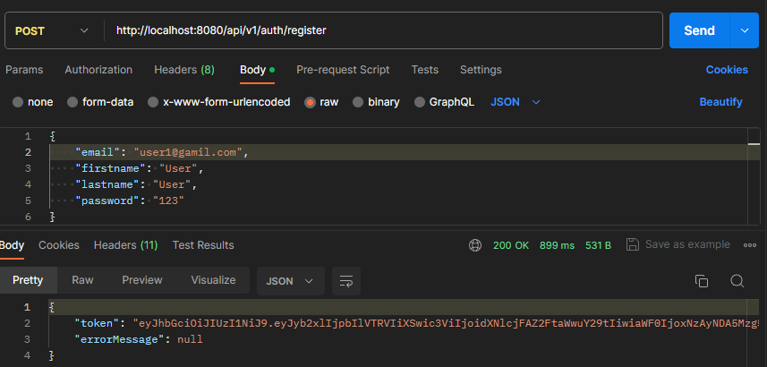
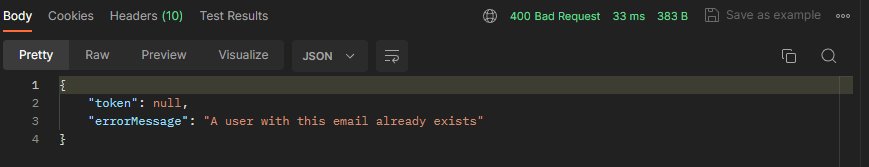
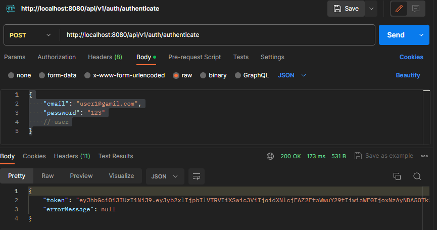
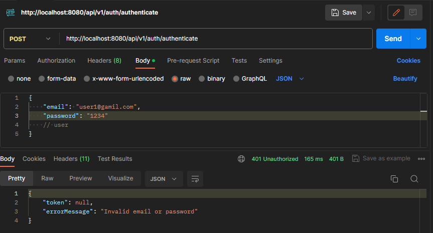

# APIforCourseworkNTU

## Тематика курсової роботи
21. Система онлайн-замовлення їжі для ресторанного бізнесу

## Клонування та Запуск Проекту

### Клонування через командний рядок

1. Відкрийте термінал або командний рядок на вашому комп'ютері.

2. Використовуючи команду git clone, склонуйте репозиторій на свій комп'ютер:

   ```bash
   git clone https://github.com/your-username/APIforCourseworkNTU.git
3. Перейдіть до папки проекту:
   ```bash
   cd APIforCourseworkNTU
### Клонування через IDE
Відкрийте вашу улюблену IDE та скористайтеся можливістю клонування репозиторію 
за допомогою його URL: https://github.com/roman50021/APIforCourseworkNTU.git

## Запуск проекту
1. Запуск через командний рядок 
2. Відкрийте термінал або командний рядок.

   Перейдіть до папки проекту:
   ```bash
   cd APIforCourseworkNTU

3. Виконайте команди для ініціалізації та запуску:
   ```bash
   npm install  # або інша команда для встановлення залежностей
   npm start    # або інша команда для запуску проекту
   
## Запуск через IDE
1. Відкрийте ваш проект у IDE.
2. Використайте вбудовані інструменти для встановлення залежностей та запуску проекту.

# Швидка перевірка
## Авторизація та реєстрація 
### Реєстрація 
   URL для перевірки (POST): 

   ```bash
    http://localhost:8080/api/v1/auth/register
   ```
   JSON для перевірки:
```bash
    {
       "email": "user@gamil.com",
       "firstname": "User",
       "lastname": "User",
       "password": "123"
    }
```
   Отримаємо відповідь: 

   

   Якщо спробуємо повторно створити цього ж користувача, отримаємо таку відповідь: 

   

   За стандартом створюватиметься користувач за ролью User.

### Авторизація
   Спробуємо авторизуватися користувача, для якого ми тільки що створили обліковий запис.

   URL для перевірки (POST):

   ```bash
    http://localhost:8080/api/v1/auth/authenticate
   ```

   JSON для перевірки:

   ```bash
       {
          "email": "user1@gamil.com",
          "password": "123"
          // user
       }
   ```
   Отримаємо відповідь, та токен для подальших дій: 

   

   Але якщо вести неправильний e-mail або пароль отримаємо таку відповідь: 

   


